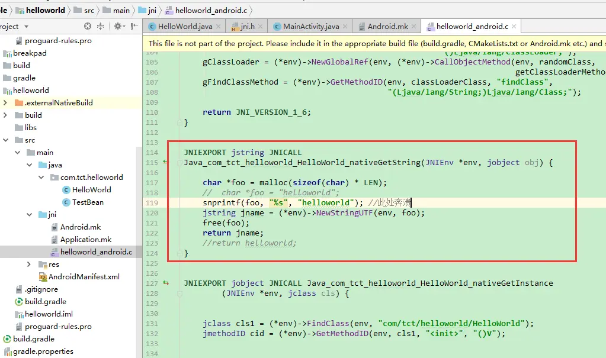
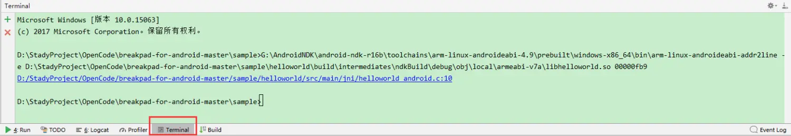
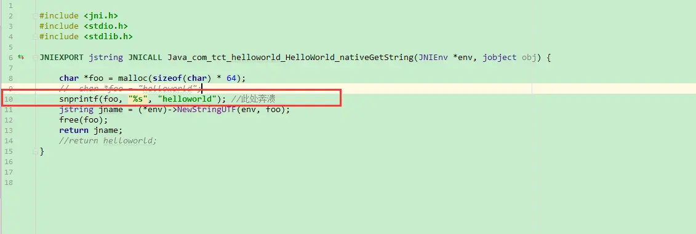
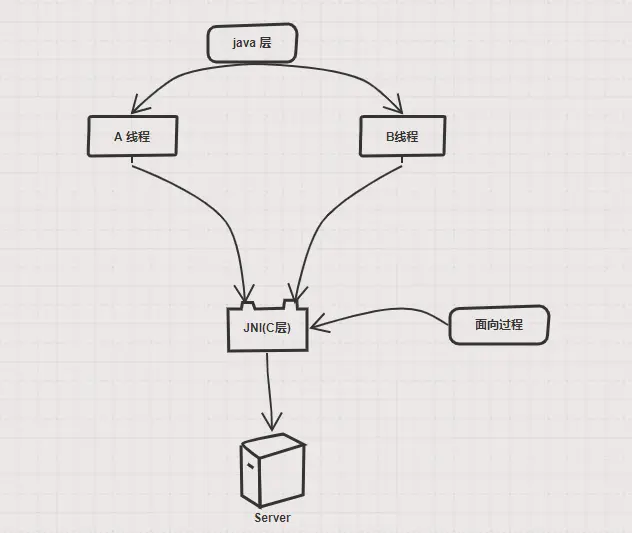
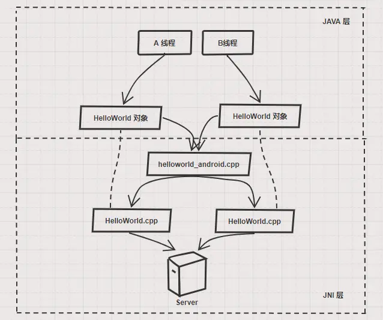

[toc]

# Android JNI 篇 - 从入门到放弃

### 一、JNI 涉及的名词概念

##### 1.1、 JNI：Java Native Interface

- 它是`Java`平台的一个特性(并不是`Android`系统特有的)。实现`Java`代码调用`C/C++`的代码，`C/C++`的代码也可以调用`Java`的代码.

##### 1.2、 二进制库分类 ： 静态库，动态库.

| 系统      | 静态库文件 |
| --------- | ---------- |
| Windows   | .lib       |
| Linux     | .a         |
| MacOS/IOS | .a         |

| 系统      | 动态库文件 |
| --------- | ---------- |
| Windows   | .dll       |
| Linux     | .so        |
| MacOS/IOS | .dylib     |

- 静态库

这么解释：

> ```
> .a` 静态库就是好多个 `.o` 合并到一块的集合，经常在编译`C` 库的时候会看到很多`.o`,这个`.o` 就是目标文件 由 `.c + .h` 编译出来的。`.c` 相当于 `.java`, `.h` 是 `C` 库对外开放的接口声明。对外开放的接口 `.h` 和 `.c` 需要一一对应，如果没有一一对应，外部模块调用了接口，编译的时候会提示找不到方法。`.a` 存在的意义可以看成 `Android aar` 存在的意义，方便代码不用重复编译， 最终为了生成 `.so (apk)
> ```

- 动态库，在 `Android` 环境下就是 `.so` ，可以直接被`java` 代码调用的库.

##### 1.3、 CPU 架构（ABI）：`armeabi，armeabi-v7a，x86，mips，arm64-v8a，mips64，x86_64`

各个平台架构的区别就是指令集不一样，浮点运算能力不一样，按照上面排列的顺序，浮点运算能力运行从低到高。

- `armeabi`:这是相当老旧的一个版本，缺少对浮点数计算的硬件支持，在需要大量计算时有性能瓶颈 （微信）
- `armeabi-v7a`: `ARM v7` 目前主流版本，兼容 `armeabi （facebook app）`
- `arm64-v8a`: `64` 位支持 兼容 `armeabi-v7a armeabi`
- `mips/mips64`: 极少用于手机可以忽略
- `x86/x86_64`: `x86` 架构一般用于 `TV` 电视机 ，兼容 `armeabi`

建议 `android apk` 为了减少包体大小只接入 `armeabi-v7a` 即可

##### 1.4、 Android 特有的文件 :`Android.mk Application.mk`

- `Android.mk`：在 `Android` 上编译需要的配置文件，相当于 `build.gradle`，详细细节后面会讲到。
- `Application.mk`：上代码


```go
APP_PLATFORM := android-14 //指定 android 系统
APP_ABI := armeabi-v7a // 指定生成哪个架构的 so
```

[更多详情](https://links.jianshu.com/go?to=https%3A%2F%2Fdeveloper.android.com%2Fndk%2Fguides%2Fapplication_mk%3Fhl%3Dzh-cn)

##### 1.5、 NDK :Android 平台上用来编译 `C/C++`库的工具

[下载地址](https://links.jianshu.com/go?to=https%3A%2F%2Fdeveloper.android.com%2Fndk%2Fdownloads%2F)

### 二、JNI 在 Android Studio 搭建

##### 2.1、创建一个子`module`(类型为library)，创建 `java` 层代码，新建一个`HelloWorld` 类准备和 `c` 层对接，代码如下：

```java
public class HelloWorld {

    static {
        try {
            System.loadLibrary("helloworld");
        } catch (Exception e) {
        }
    }
    private volatile static HelloWorld instance;
    private HelloWorld() {
    }
    public static HelloWorld getInstance() {
        if(instance == null) {
            synchronized (HelloWorld.class) {
                if(instance == null) {
                    instance = new HelloWorld();
                }
            }
        }
        return  instance;
    }


  public native String nativeGetString();

}
```

很明显上面类分成三部分：

- 有 `static` 代码块，调用了`System.loadLibrary("helloworld");`这句代码代表着，使用这个类之前都会去加载`libhelloworld.so` 这个动态库，注意`.so`前面有`lib`。那这个动态库如何生成，后面讲。
- 这个类是一个单例
- 有一个 `native` 的方法 `public native String nativeGetString();`这个方法的实现在 `c` 层。所以接下来我们要构建 `c` 层的代码。

##### 2.2、接着在子`module`的目录下建立一个叫做 `jni` 的文件夹。例如：


##### 2.3、创建 `c` 代码，和配置文件，看下图的位置：




- 生成一个 `helloworld_android.c`，代码如下：对接 `java` 层 ，下面的方法
  `JNIEXPORT jstring JNICALL Java_com_tct_helloworld_HelloWorld_nativeGetString(JNIEnv *env, jobject obj)` 是 `java` 层 `public native String nativeGetString();` 方法的 代码实现：


```cpp
#include <jni.h>
#include <stdio.h>
#include <stdlib.h>

//public native String nativeGetString();

JNIEXPORT jstring JNICALL Java_com_tct_helloworld_HelloWorld_nativeGetString(JNIEnv *env, jobject obj) {

    char *foo = malloc(sizeof(char) * 64); //申请内存
    //  char *foo = "helloworld";
    snprintf(foo, "%s", "helloworld"); //写入字符串到foo指针
    jstring jname = (*env)->NewStringUTF(env, foo);
    free(foo); //释放指针
    foo = NULL;
    return jname;  //返回字符串
    //return helloworld;
}
```

- 生成并编写 `Android.mk`,代码如下


```ruby
#获取当前目录的相对路径，也就是当前文件的父路径
LOCAL_PATH := $(call my-dir)
#清除当前的所有变量值
include $(CLEAR_VARS)

#本模块需要调用到的接口，也就是.h 文件
#LOCAL_C_INCLUDES := XXX

#本模块需要编译到的 c 文件
LOCAL_SRC_FILES := helloworld_android.c

#加入第三方库log库，NDK 自带的
LOCAL_LDLIBS := -llog

#生成库的名字。最终生成 libhelloworld
LOCAL_MODULE    := helloworld

#生成的是动态库.so
include $(BUILD_SHARED_LIBRARY)


#生成的是动态库.a
#include $(BUILD_STATIC_LIBRARY)
```

- 生成并编写 `Application.mk`


```go
APP_ABI := armeabi-v7a //生成 armeabi-v7a  的 so
APP_PLATFORM := android-21 //指定 tagerSDK
```

##### 2.4、接下来配置子 `module` 的 `build.gradle` 和 `NDK`


```php
apply plugin: 'com.android.library'

android {
    compileSdkVersion 27

    externalNativeBuild.ndkBuild {
        path "src/main/jni/Android.mk" //指定c 层的 mk 文件的位置
    }
    defaultConfig {
        versionCode 1
        versionName "1.0"

        sourceSets {
            main {
                jni.srcDirs = [] //run 的时候不会重新编译 jni ，只有make 的时候生效
            }
        }
        ndk {
            abiFilters "armeabi-v7a"//让APK只包含指定的ABI
        }
    }
}

dependencies {
    implementation fileTree(dir: 'libs', include: ['*.jar'])
}
```

根目录下的 `local.properties`，配置自己的 `NDK` 路径


```undefined
ndk.dir=G\:\\AndroidNDK\\android-ndk-r16b
```

##### 2.5、把项目跑起来

- make一下子module，把项目编译一下。把.so和.aar一次编译出来。


- 观察编译完毕的目录结构，`aar`是出来了，但是好像没有发现 `so` 的踪影。


- 解压aar，aar其实就是zip，压缩，只是谷歌把它换了个后缀名）。

  


##### 2.6、最后写个`MainActivity.java` 调用一下接口

- 调用接口代码

```csharp
    @OnClick(R.id.btnTestNDKCrash)
    void testNDKCrash(){
        String ret = HelloWorld.getInstance().nativeGetString();
        System.out.println("test " + ret);
    }
```

- 发现崩溃了，如何定位并且解决？先看`log`


> 很明显这种异常，是崩溃在c层的log，并且 java 层是无法 try - catch 住的。只能在 c 层去解决这个问题。我们在项目中有时候也会遇到这种异常，有的时候是系统库奔溃了（无解，只能从java 层检查是否有 规范的调用接口），有时候是第三方的 so 库奔溃了（找到jni 的源码才能解决）。

- 定位并解决问题

命令行：

```css
G:\AndroidNDK\android-ndk-r16b\toolchains\arm-linux-androideabi-4.9\prebuilt\windows-x86_64\bin\arm-linux-androideabi-addr2line -e D:\StadyProject\OpenCode\breakpad-for-android-master\sample\helloworld\build\intermediates\ndkBuild\debug\obj\local\armeabi-v7a\libhelloworld.so 00000fb9
```

打开你的 `Terminal` 把上面的命令输进去，就可以看到闪退的代码行了：



定位奔溃的代码行：

```css
G:\AndroidNDK\android-ndk-r16b\toolchains\arm-linux-androideabi-4.9\prebuilt\windows-x86_64\bin\arm-linux-androideabi-addr2line -e
```

目标文件 `so` 库的位置，`so`一个存在 `aar` ，一个存在 `build` 目录下面，位置比较深，但是都是固定目录，可以找到：

```bash
D:\StadyProject\OpenCode\breakpad-for-android-master\sample\helloworld\build\intermediates\ndkBuild\debug\obj\local\armeabi-v7a\libhelloworld.so
```

奔溃的内存位置：

```undefined
00000fb9
```

崩溃的代码行：

> 
>

这句代码的意思是把 helloworld 字符串赋值到 foo 这个变量中去。但是少传了一个参数导致崩溃。 看下面两个函数的不同处

```cpp
snprintf(foo, LEN, "%s", "helloworld");//最多传入 foo 能承载的字符数，多了一个参数
sprintf(foo, "%s", "helloworld");//无指定写入多少字符
```

那么改成以下代码，就可以了

```cpp
#define LEN 64
snprintf(foo, LEN, "%s", "helloworld");
```

再回顾一下 `java`层代码：

```csharp
   @OnClick(R.id.btnTestNDKCrash)
    void testNDKCrash(){
        String ret = HelloWorld.getInstance().nativeGetString();
        System.out.println("test "+ret);
    }
```

跑起来`logcat`：


### 三、JNI 类型，方法对照表

##### 3.1、基本类型对照表

| Java类型  | 本地类型      | 描述                                     |
| --------- | ------------- | ---------------------------------------- |
| boolean   | jboolean      | C/C++8位整型                             |
| byte      | jbyte         | C/C++带符号的8位整型                     |
| char      | jchar         | C/C++无符号的16位整型                    |
| short     | jshort        | C/C++带符号的16位整型                    |
| int       | jint          | C/C++带符号的32位整型                    |
| long      | jlong         | C/C++带符号的64位整型e                   |
| float     | jfloat        | C/C++32位浮点型                          |
| double    | jdouble       | C/C++64位浮点型                          |
| Object    | jobject       | 任何Java对象，或者没有对应java类型的对象 |
| Class     | jclass        | Class对象                                |
| String    | jstring       | 字符串对象                               |
| Object[]  | jobjectArray  | 任何对象的数组                           |
| boolean[] | jbooleanArray | 布尔型数组                               |
| byte[]    | jbyteArray    | 比特型数组                               |
| char[]    | jcharArray    | 字符型数组                               |
| short[]   | jshortArray   | 短整型数组                               |
| int[]     | jintArray     | 整型数组                                 |
| long[]    | jlongArray    | 长整型数组                               |
| float[]   | jfloatArray   | 浮点型数组                               |
| double[]  | jdoubleArray  | 双浮点型数组                             |

##### 3.2、jni 层使用 java 类方法名称

Java类型 | 本地类型 | 描述

| 函数                    | Java数组类型  | 本地类型 |
| ----------------------- | ------------- | -------- |
| GetBooleanArrayElements | jbooleanArray | jboolean |
| GetByteArrayElements    | jbyteArray    | jbyte    |
| GetCharArrayElements    | jcharArray    | jchar    |
| GetShortArrayElements   | jshortArray   | jshort   |
| GetIntArrayElements     | jintArray     | jint     |
| GetLongArrayElements    | jlongArray    | jlong    |
| GetFloatArrayElements   | jfloatArray   | jfloat   |
| GetDoubleArrayElements  | jdoubleArray  | jdouble  |

| 函数              | 描述                   |
| ----------------- | ---------------------- |
| GetFieldID        | 得到一个实例的域的ID   |
| GetStaticFieldID  | 得到一个静态的域的ID   |
| GetMethodID       | 得到一个实例的方法的ID |
| GetStaticMethodID | 得到一个静态方法的ID   |

| Java 类型   | 符号                                          |
| ----------- | --------------------------------------------- |
| boolean     | Z                                             |
| byte        | B                                             |
| char        | C                                             |
| short       | S                                             |
| int         | I                                             |
| long        | L                                             |
| float       | F                                             |
| double      | D                                             |
| void        | V                                             |
| objects对象 | Lfully-qualified-class-name;L类名             |
| Arrays数组  | [array-type [数组类型                         |
| methods方法 | (argument-types)return-type(参数类型)返回类型 |

### 四、JNI 场景实践

由于上面看了方法的对照表，下面讲解如何使用：

##### 4.1、`java` 调用到 `C` 层


```java
// JAVA 层方法
public native String nativeGetString(String tmp);
// 对应 JNI 层方法
JNIEXPORT jstring JNICALL
Java_com_tct_helloworld_HelloWorld_nativeGetString(JNIEnv *env, jobject obj,jstring jtmp) {
}
```


```java
// JAVA 层方法
public native void nativeGetString(Model tmp);
// 对应 JNI 层方法
JNIEXPORT void JNICALL
Java_com_tct_helloworld_HelloWorld_nativeGetString(JNIEnv *env, jobject obj,jobject jmod) {
}
```

- `JNIEnv *env` 是 `JNI` 中 `java` 线程的上下文，每一个线程都有一个 `env`。
- `jobject obj` 代表的 `java` 的对象，从`java` 哪个对象调用下来的，就是哪对象。

##### 4.2、`C` 层解析 `java` 类中的属性值，转成 `C` 层可使用的类型


```java
//java 类
public class Model {

    public int code;
    public String name;

    public Model(int code, String name) {
        this.code = code;
        this.name = name;
    }
}

// JAVA 层方法
public native void nativeGetString(Model tmp);
// 对应 JNI 层方法
JNIEXPORT void JNICALL
Java_com_tct_helloworld_HelloWorld_nativeGetString(JNIEnv *env, jobject obj,jobject jmodel) {

   jclass jmodelClass = (*env)->GetObjectClass(env, jmodel);

    if (jmodelClass == 0) {
        return;
    }
    //获取变量 code 的值
    jfieldID fidCode = (*env)->GetFieldID(env, jmodelClass, "code", "I");
    int code = (*env)->GetIntField(env, jmodel, fidCode);

   //获取变量 name 的值
    jfieldID fidName = (*env)->GetFieldID(env, jmodelClass, "name",
                                           "Ljava/lang/String;");
    jstring jname = (jstring)(*env)->GetObjectField(env, jmodel, fidName);
    char *name = (*env)->GetStringUTFChars(env, jname, 0);
    
    // ..
    
    //使用完毕，char * 需要回收
    (*env)->ReleaseStringUTFChars(env, jname, name);
    // 自己生成的 jclass 需要回收，以及其他的引用也是需要的，局部变量不能超512 个，特别是在 for 循环体内要及时回收
    (*env)->DeleteLocalRef(env, jmodelClass);
}
```

##### 4.3、`C` 层返回 `java` 对象


```java
//java 层方法
private volatile static HelloWorld instance;
private HelloWorld() {
}
public static HelloWorld getInstance() {
    if(instance == null) {
       synchronized (HelloWorld.class) {
         if(instance == null) {
                instance = new HelloWorld();
           }
        }
   }
    return  instance;
}
public native static HelloWorld nativeGetInstance();

//C层方法
JNIEXPORT jobject JNICALL Java_com_tct_helloworld_HelloWorld_nativeGetInstance
        (JNIEnv *env, jclass cls) {
    //找到class
    jclass cls1 = (*env)->FindClass(env, "com/tct/helloworld/HelloWorld");
    //找到构造函数的方法ID
    jmethodID cid = (*env)->GetMethodID(env, cls1, "<init>", "()V");

    //生成一个对象返回
    jobject jInstance = (*env)->NewObject(env, cls1, cid);

    return jInstance;
}


// MainActivity.java 的调用方法
  @OnClick(R.id.btnTestNDKCrash)
    void testNDKCrash(){
        if(HelloWorld.getInstance() == HelloWorld.nativeGetInstance()) {
            System.out.println("HelloWorld instance true");
        } else {
            System.out.println("HelloWorld instance false");
        }

    }
```

得出 `log`：

```csharp
I/System.out: HelloWorld instance false
```

原来不仅仅反射机制能破解单例， `JNI` 也是可以破解单例。

##### 4.4、`C` 层返回 `java` 对象数组


```php
//java 层代码
public native static HelloWorld[] nativeGetInstanceArray();
// c 层代码   
JNIEXPORT jobjectArray JNICALL Java_com_tct_helloworld_HelloWorld_nativeGetInstanceArray
        (JNIEnv *env, jclass cls) {
    jclass cls1 = (*env)->FindClass(env, "com/tct/helloworld/HelloWorld");
    jmethodID cid = (*env)->GetMethodID(env, cls1, "<init>", "()V");
    jsize len = 10;
    jobjectArray mjobjectArray;
    //新建object数组
    mjobjectArray = (*env)->NewObjectArray(env, len, cls1, 0);
    for (int i = 0; i < len; ++i) {
        jobject jInstance = (*env)->NewObject(env, cls1, cid);
        (*env)->SetObjectArrayElement(env, mjobjectArray, i, jInstance);
        //回收，局部引用不能超过512个
        (*env)->DeleteLocalRef(env, jInstance);
    }

    (*env)->DeleteLocalRef(env, cls1);
    return mjobjectArray;
}

//MainActivity.java 调用
  @OnClick(R.id.btnTestNDKCrash)
    void testNDKCrash(){
        HelloWorld[] HelloWorlds = HelloWorld.getInstance().nativeGetInstanceArray();
        System.out.println("HelloWorld arrays length:"+HelloWorlds.length);
    }
```

`log`:


```csharp
I/System.out: HelloWorld arrays length:10
```

##### 4.5、`C` 层回调到 `java` 层


```php
//java 层方法

public class TestBean {

    public int code;
    public String name;

    public TestBean(int code, String name) {
        this.code = code;
        this.name = name;
    }

    @Override
    public String toString() {
        return "TestBean{" +
                "code=" + code +
                ", name='" + name + '\'' +
                '}';
    }
}

 public interface HelloWorldListener {
        public void onLinstener(TestBean testBean);
}
    
public native  void nativeGetInstanceByThread(HelloWorldListener listener);
 
 


//c 层方法  


//jni 当前上下文，可用于当前 native 线程加入java 线程，用于回调，或者是获取 jvm 线程 上下文
JavaVM *g_VM;
//用来 findClass
jobject gClassLoader;
jmethodID gFindClassMethod;

//获取jvm 上下文
JNIEnv *getEnv() {
    JNIEnv *env;
    int status = (*g_VM)->GetEnv(g_VM, (void **) &env, JNI_VERSION_1_6);
    if (status < 0) {
        status = (*g_VM)->AttachCurrentThread(g_VM, &env, NULL);
        if (status < 0) {
            return NULL;
        }
    }
    return env;
}

/**
*  java 层调用 System.loadLibrary(); 的时候就会调用这个方法，此方法的目的是 找到classloader的对象，还有类加载的方法ID
*/
JNIEXPORT jint JNICALL JNI_OnLoad(JavaVM *pjvm, void *reserved) {
    g_VM = pjvm;  // cache the JavaVM pointer
    JNIEnv *env = getEnv();
    //replace with one of your classes in the line below
    jclass randomClass = (*env)->FindClass(env, "com/tct/helloworld/HelloWorld");
    jclass classClass = (*env)->GetObjectClass(env, randomClass);
    jclass classLoaderClass = (*env)->FindClass(env, "java/lang/ClassLoader");
    jclass getClassLoaderMethod = (*env)->GetMethodID(env, classClass, "getClassLoader",
                                                      "()Ljava/lang/ClassLoader;");
    gClassLoader = (*env)->NewGlobalRef(env, (*env)->CallObjectMethod(env, randomClass,
                                                                      getClassLoaderMethod));
    gFindClassMethod = (*env)->GetMethodID(env, classLoaderClass, "findClass",
                                           "(Ljava/lang/String;)Ljava/lang/Class;");

    return JNI_VERSION_1_6;
}

//调用ClassLoder 去找到对应的类，在linux 线程是独立于JVM ，所以一般的 findClass 是找不到jvm中的类。只能使用八大基本类型。
jclass GlobalFindClass(const char* name) {
    JNIEnv* env = getEnv();
    return (jclass)((*env)->CallObjectMethod(env,gClassLoader, gFindClassMethod, (*env)->NewStringUTF(env,name)));
}

void test_process(void *p) {
    jobject callBack = (jobject)p;
    JNIEnv *env;
    jboolean mNeedDetach;
    //获取当前native线程是否有没有被附加到jvm环境中
    int getEnvStat = (*g_VM)->GetEnv(g_VM, (void **) &env, JNI_VERSION_1_6);
    if (getEnvStat == JNI_EDETACHED) {
        //如果没有， 主动附加到jvm环境中，获取到env
        if ((*g_VM)->AttachCurrentThread(g_VM, &env, NULL) != 0) {
            return;
        }
        mNeedDetach = JNI_TRUE;
    }
    jclass cls = GlobalFindClass( "com/tct/helloworld/TestBean");
    if (cls == 0) {
        LOGI("native cls= %ld", cls);
        return;
    }
    jmethodID cid = (*env)->GetMethodID(env, cls, "<init>", "(ILjava/lang/String;)V");
    jstring name = (*env)->NewStringUTF(env,"helloworld");
    jobject jInstance = (*env)->NewObject(env, cls, cid,(jint)1, name);


    //获取回调的类
    jclass  jcallBackClass = (*env)->GetObjectClass(env,callBack);

    //通过回调的类找到回调的方法
    jmethodID callbackid = (*getEnv())->GetMethodID(env, jcallBackClass, "onLinstener", "(Lcom/tct/helloworld/TestBean;)V");
    if(callbackid ==0) {
        return;
    }

    //调用回调的方法
    (*env)->CallVoidMethod(env,callBack,callbackid,jInstance);

    (*env)->DeleteGlobalRef(env, callBack);
    (*env)->DeleteLocalRef(env, jcallBackClass);
    (*env)->DeleteLocalRef(env, jInstance);
    (*env)->DeleteLocalRef(env, cls);
    (*env)->DeleteLocalRef(env, name);

    //释放当前线程
    if (mNeedDetach) {
        (*g_VM)->DetachCurrentThread(g_VM);
    }

}

int start_test_thread(jobject listener) {
    pthread_t tid;
    if (0 != (pthread_create(&tid, NULL, test_process, listener))) {
        return -1;
    } else {
        pthread_detach(tid); //设置成 分离线程，线程跑完自己回收内存
    }
    return 0;
}

JNIEXPORT void JNICALL Java_com_tct_helloworld_HelloWorld_nativeGetInstanceByThread
        (JNIEnv *env, jobject obj,jobject jListener) {
// 这里的内存区域属于 native 栈中。跑完这个方法，局部变量都会被回收。所以需要使用 NewGlobalRef 对 jListener 生成一个全局引用（linux 堆中）
    jobject callback = (*env)->NewGlobalRef(env, jListener);
    //开启线程
    start_test_thread(callback);
}
```

C 层回调 Java 层 方法，更多的解决方案，详细查看我的[另一篇博客](https://www.jianshu.com/p/e576c7e1c403)

### 五、JNI Java 和 C++ 无缝对接

##### 5.1、 以上实践都是 `java` 和 `C` 的对接。然而 `java` 是面向对象， `C` 是面向过程没有对象的概念。

- 举个场景例子：

> 如果 `java` 层需要发起`A`、`B`个线程 到`C`层去请求数据，并且需要各自提供 请求、取消的接口。要实现多线程的取消接口，如果使用 `C` 封装 `JNI`，就需要提供链表（或者其他集合的数据结构）把每一个线程的 `Tid（java）`，和请求绑定起来，取消的时候通过链表找到该线程的请求把柄，通过把柄取消。期间你会遇到链表插入删除，多线程锁，还得多个链表的全局引用。非常麻烦。




- 然而 `java` 就是为了避免这种麻烦，实现高效率编程。面向对象诞生了。
- 那么如何从 `java` -> `C++`->`C` 进行调用。上流程图，上代码：



image

```
java` 层对接类 `HelloWorld.java
```


```java
public class HelloWorld {
    //加入一个变量 long 型保存 C++ 对象的地址
    public long mNativeContext = 0L;
    //类被创建，相对应的 JNI 也创建一个类
    public HelloWorld() {
        init();
    }
    public native void init();
    //..
}
```

`JNI` 层新建两个文件：`HelloWorld.cpp`、`HelloWorld.h`。
`HelloWorld.cpp` 代码：


```cpp
#include "HelloWorld.h"

extern "C" {

}

HelloWorld::HelloWorld() {
}

HelloWorld::~HelloWorld() {

}

 char * HelloWorld::getString() {
     return  "HelloWorld";

}
```

`HelloWorld.h` 代码


```cpp
#ifndef HelloWorld_H
#define HelloWorld_H


class HelloWorld
{

public:
    HelloWorld();
    ~HelloWorld();
    char * getString();
};

#endif
```

`JNI` 层接口 `helloworld_android.c` 代码：


```cpp
//创建一个结构体存放对象地址
typedef struct {
    jfieldID context;
} fields_t;

static fields_t fields;

//  System.loadLibrary("helloworld");触发被调用的方法
JNIEXPORT jint JNICALL JNI_OnLoad(JavaVM *pjvm, void *reserved) {
    JNIEnv *env = getEnv();
    //获取 java 层 mNativeContext 变量的 ID ，并赋值到 fields.context 这个全局变量。
    fields.context = env->GetFieldID(randomClass, "mNativeContext", "J");
    // ...
    return JNI_VERSION_1_6;
}

JNIEXPORT void  JNICALL Java_com_tct_helloworld_HelloWorld_init
        (JNIEnv *env, jobject obj) {
  //初始化，HelloWorld 指针对象，并且强转指针为 long 型，赋值到 对应的java 对象中 mNativeContext 的变量中去
    HelloWorld *mHelloWorld = new HelloWorld();
    env->SetLongField(obj, fields.context, (long)mHelloWorld);
}
```

最后验证一下：


```csharp
//java 层代码
//MainActivity.java
System.out.println("test1" +new HelloWorld().nativeGetStringByObject());
System.out.println("test2" +new HelloWorld().nativeGetStringByObject());

//HelloWorld.java
public native String nativeGetStringByObject();
  
//C 层代码 
static HelloWorld *getObject(JNIEnv *env, jobject thiz) {
    // No lock is needed, since it is called internally by other methods that are protected
    HelloWorld *retriever = (HelloWorld *) env->GetLongField(thiz,fields.context);
    return retriever;
}

JNIEXPORT jstring  JNICALL Java_com_tct_helloworld_HelloWorld_nativeGetStringByObject(JNIEnv *env, jobject obj) {
  char * p = getObject(env,obj)->getString();
  return env->NewStringUTF(p);
}
```

`log` ：


```csharp
I/System.out: test1HelloWorld
I/System.out: test2HelloWorld
```

#### 六、JNI 开源实战

对于 `JNI` 的一些的基本知识基本就讲完了。`JNI` 的用途为 `java` 开辟了另一扇大门，所有能在`C` 上面实现的。都能拿过来给`Android`平台上使用。
譬如以下一些 `C`库：

- 音视频播放库
- 高斯模糊库
- `openCV` 人脸识别，车牌号码识别
- 苹果的 `AirPlay`协议 蓝牙耳机

更多 `C` 库[详情地址](https://links.jianshu.com/go?to=https%3A%2F%2Fgithub.com%2Fjobbole%2Fawesome-c-cn)

接下来实战一个 `bilibili/ijkPlayer`音视频解码库的开源代码。
[传送门](https://www.jianshu.com/p/5aae140956ee)

注： 感谢 [http://www.cnblogs.com/daniel-shen/archive/2006/10/16/530587.html](https://links.jianshu.com/go?to=http%3A%2F%2Fwww.cnblogs.com%2Fdaniel-shen%2Farchive%2F2006%2F10%2F16%2F530587.html) 提供表格

推荐阅读：[Android 编译速度优化黑科技 - RocketX](https://www.jianshu.com/p/59b95b5a7fab)

本文开头demo地址： https://github.com/LShuXin/jniMainProj